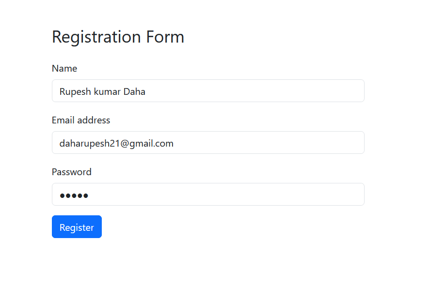
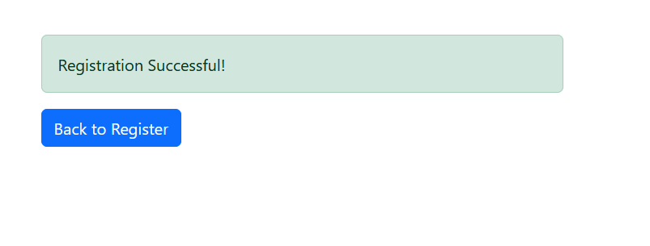

# Flask Registration Form

A simple Flask application that provides a user registration form styled with Bootstrap. User information is stored in a MySQL database upon successful registration.

## Table of Contents

- [Features](#features)
- [Prerequisites](#prerequisites)
- [Installation](#installation)
- [Database Setup](#database-setup)
- [Running the Application](#running-the-application)
- [Project Structure](#project-structure)
- [Screenshots](#screenshots)
- [Technologies Used](#technologies-used)
- [License](#license)

## Features

- **User Registration**: Collects user's name, email, and password.
- **MySQL Integration**: Stores user data securely in a MySQL database.
- **Bootstrap Styling**: Provides a responsive and modern user interface.
- **Success Confirmation**: Displays a confirmation message upon successful registration.

## Prerequisites

Before you begin, ensure you have met the following requirements:

- **Python 3.x** installed on your machine.
- **MySQL Server** installed and running.
- **pip** package manager installed.
- **Git** (optional, for cloning the repository).

## Installation

Follow these steps to set up the project locally.

### 1. Clone the Repository

```bash
git clone https://github.com/daharupesh/RegistrationFormUsingFlask.git
cd flask-registration
```

*Alternatively, you can download the repository as a ZIP file and extract it.*

### 2. Set Up a Virtual Environment (Optional but Recommended)

It's good practice to use a virtual environment to manage your project's dependencies.

```bash
python -m venv venv
```

Activate the virtual environment:

- **On Windows:**

  ```bash
  venv\Scripts\activate
  ```

- **On macOS and Linux:**

  ```bash
  source venv/bin/activate
  ```

### 3. Install Dependencies

Ensure you have `pip` installed, then install the required Python packages:

```bash
pip install Flask mysql-connector-python
```

*If you have a `requirements.txt` file, you can install all dependencies with:*

```bash
pip install -r requirements.txt
```

## Database Setup

Set up the MySQL database to store user registrations.

### 1. Access MySQL

Open your terminal or command prompt and log in to MySQL:

```bash
mysql -u root -p
```

Enter your MySQL root password when prompted.

### 2. Create a Database

```sql
CREATE DATABASE mydatabase;
```

### 3. Create a User (Optional)

*It's a good practice to create a dedicated user for your application.*

```sql
CREATE USER 'root'@'localhost' IDENTIFIED BY 'your_password';
GRANT ALL PRIVILEGES ON mydatabase.* TO 'root'@'localhost';
FLUSH PRIVILEGES;
```

*Replace `'your_password'` with a secure password.*

### 4. Create the `users` Table

```sql
USE mydatabase;

CREATE TABLE users (
    id INT AUTO_INCREMENT PRIMARY KEY,
    name VARCHAR(100) NOT NULL,
    email VARCHAR(100) NOT NULL UNIQUE,
    password VARCHAR(255) NOT NULL
);
```


## Running the Application

Start the Flask development server to run the application locally.

```bash
python app.py
```

By default, the application runs on `http://localhost:5000/`. Open this URL in your web browser to access the registration form.


## Screenshots

Below are screenshots of the application's templates. Replace the placeholders with your actual screenshots.

### Registration Form (`register.html`)



*Description: The registration form where users can input their name, email, and password.*

### Success Page (`success.html`)



*Description: Confirmation page displayed after successful registration.*

> **Note**: To include screenshots in your README, save the images (e.g., `register_form.png` and `success_page.png`) in a directory (e.g., `screenshots/`) within your project and reference them accordingly:

```markdown

```

Ensure that the image paths are correct relative to the `README.md` file.

## Technologies Used

- **[Flask](https://flask.palletsprojects.com/)**: A lightweight WSGI web application framework.
- **[MySQL](https://www.mysql.com/)**: Relational database management system.
- **[Bootstrap](https://getbootstrap.com/)**: Front-end component library for designing responsive websites.
